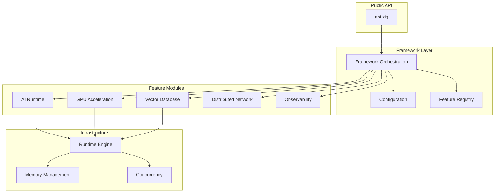

# 🚀 Abi AI Framework

var agent = try abi.ai.agent.Agent.init(allocator, .{
    .name = "Assistant",
    .max_retries = 3,
});
defer agent.deinit();

[](https://ziglang.org/) • [Docs](https://donaldfilimon.github.io/abi/) • [CI: Pages](.github/workflows/deploy_docs.yml)
[](LICENSE)
[](https://github.com/yourusername/abi)
[]()
[]()
[]()

</details>

<details>
<summary><b>Vector Database</b></summary>

```zig
const gpu = abi.gpu;

var backend = try gpu.selectBackend(allocator);
defer backend.deinit();

### **Prerequisites**
- **Zig 0.16.0-dev.1225+bf9082518** (GitHub Actions uses `mlugg/setup-zig@v2` pinned to this version)
- GPU drivers (optional, for acceleration)
- OpenAI API key (for AI agent features)

## 🤝 Contributing

We welcome contributions! Please see our [Contributing Guide](CONTRIBUTING.md) for details.

pub fn main() !void {
    var gpa = std.heap.GeneralPurposeAllocator(.{}){};
    const allocator = gpa.allocator();
    defer _ = gpa.deinit();

    // Create a 384-dimensional vector database
    var db = try abi.wdbx.createDatabase(allocator, .{ .dimension = 384 });
    defer db.deinit();

    // Insert vectors
    try db.insertVector(1, &embedding1);
    try db.insertVector(2, &embedding2);

    // Search for similar vectors
    const results = try db.searchVectors(&query_embedding, 10);
    defer allocator.free(results);

    for (results) |result| {
        std.debug.print("ID: {d}, Score: {d:.4}\n", .{ result.id, result.score });
    }
}
```

</details>

<details>
<summary><b>GPU-Accelerated Compute</b></summary>

```zig
const abi = @import("abi");

pub fn main() !void {
    var gpa = std.heap.GeneralPurposeAllocator(.{}){};
    const allocator = gpa.allocator();
    defer _ = gpa.deinit();

    // Auto-selects best available backend (CUDA > Vulkan > Metal > CPU)
    var gpu = try abi.Gpu.init(allocator, .{
        .enable_profiling = true,
        .memory_mode = .automatic,
    });
    defer gpu.deinit();

    const a = try gpu.createBufferFromSlice(f32, &[_]f32{ 1, 2, 3, 4 }, .{});
    const b = try gpu.createBufferFromSlice(f32, &[_]f32{ 4, 3, 2, 1 }, .{});
    const result = try gpu.createBuffer(4 * @sizeOf(f32), .{});
    defer { gpu.destroyBuffer(a); gpu.destroyBuffer(b); gpu.destroyBuffer(result); }

// Add embeddings
const embedding = [_]f32{0.1, 0.2, 0.3, /* ... */};
const row_id = try db.addEmbedding(&embedding);

    var output: [4]f32 = undefined;
    try result.read(f32, &output);
    // output = { 5, 5, 5, 5 }
}
```

</details>

<details>
<summary><b>Training Pipeline</b></summary>

```zig
const abi = @import("abi");

pub fn main() !void {
    var gpa = std.heap.GeneralPurposeAllocator(.{}){};
    const allocator = gpa.allocator();
    defer _ = gpa.deinit();

    const config = abi.features.ai.TrainingConfig{
        .epochs = 10,
        .batch_size = 32,
        .learning_rate = 0.001,
        .optimizer = .adamw,
    };

    var result = try abi.features.ai.trainWithResult(allocator, config);
    defer result.deinit();

    std.debug.print("Final loss: {d:.6}\n", .{result.report.final_loss});
}
```

</details>

---

## CLI Reference

### Adding CLI/TUI tools via the comptime DSL

- Define command metadata in the command module using `pub const meta: command.Meta`.
- Keep registry ordering/metadata overrides in `/Users/donaldfilimon/abi/tools/cli/registry/overrides.zig`.
- Refresh the generated registry snapshot with `zig build refresh-cli-registry` after adding commands.
- Use command metadata fields for options/UI/risk so launcher/completion/help are derived from one source.
- For simple UI dashboards, use `/Users/donaldfilimon/abi/tools/cli/ui/dsl/mod.zig` to avoid repeated theme/session/dashboard boilerplate.
- Refresh/check registry snapshots with:
`zig build refresh-cli-registry`
`zig build check-cli-registry`

```bash
# Core Commands
abi --help                    # Show all commands
abi system-info               # System and feature status
abi ui launch                 # Interactive TUI launcher

# Database Operations
abi db stats                  # Database statistics
abi db add --id 1 --embed "text"
abi db search --embed "query" --top 5
abi db backup --path backup.db

# AI & Agents
abi agent                     # Interactive chat
abi agent --persona coder     # Use specific persona
abi agent -m "Hello"          # One-shot message
abi llm chat model.gguf       # Chat with local model

# GPU Management
abi gpu backends              # List available backends
abi gpu devices               # Enumerate all GPUs
abi gpu summary               # Quick status

# Training
abi train run --epochs 10     # Start training
abi train resume ./checkpoint # Resume from checkpoint
abi train monitor             # Real-time metrics

# Runtime Feature Flags
abi --list-features           # Show feature status
abi --enable-gpu db stats     # Enable feature for command
abi --disable-ai system-info  # Disable feature for command
```

---

## Performance

<div align="center">

| Benchmark | Operations/sec |
|:----------|---------------:|
| SIMD Vector Dot Product | **84,875,233** |
| SIMD Vector Addition | **84,709,869** |
| Configuration Loading | **66,476,102** |
| Memory Allocation (1KB) | **464,712** |
| Logging Operations | **331,960** |
| Compute Engine Task | **93,368** |
| Network Registry Ops | **84,831** |
| JSON Parse/Serialize | **83,371** |
| Database Vector Insert | **68,444** |
| Database Vector Search | **56,563** |

<sub>ReleaseFast build on typical development workstation. Run `zig build benchmarks` to test your system.</sub>

</div>

---

## Architecture

```
abi/
├── src/
│   ├── abi.zig           # Public API entry point
│   ├── config/           # Unified configuration
│   ├── framework.zig     # Lifecycle orchestration
│   ├── platform/         # Platform detection (OS, arch, CPU)
│   │
│   ├── ai/               # AI Module
│   │   ├── llm/          # Local LLM inference (Llama-CPP parity)
│   │   ├── agents/       # Agent runtime with personas
│   │   ├── training/     # Training pipelines
│   │   └── embeddings/   # Vector embeddings
│   │
│   ├── gpu/              # GPU Acceleration
│   │   ├── backends/     # CUDA, Vulkan, Metal, WebGPU, FPGA
│   │   ├── kernels/      # Compute kernels
│   │   └── dsl/          # Shader DSL & codegen
│   │
│   ├── database/         # Vector Database (WDBX)
│   │   ├── hnsw.zig      # HNSW indexing
│   │   └── distributed/  # Sharding & replication
│   │
│   ├── runtime/          # Compute Infrastructure
│   │   ├── engine/       # Work-stealing scheduler
│   │   ├── concurrency/  # Lock-free primitives
│   │   └── memory/       # Pool allocators
│   │
│   ├── network/          # Distributed Compute
│   │   └── raft/         # Consensus protocol
│   │
│   ├── shared/           # Shared utilities (security, io, utils)
│   │
│   └── observability/    # Metrics & Tracing
│
├── tools/cli/            # CLI implementation
├── examples/             # Usage examples
└── docs/                 # Documentation
```

<details>
<summary><b>System Architecture Diagram</b></summary>



</details>

---

## Feature Flags

All features are enabled by default. Disable unused features to reduce binary size.

| Flag | Default | Description |
|:-----|:-------:|:------------|
| `-Denable-ai` | true | AI features, agents, and connectors |
| `-Denable-llm` | true | Local LLM inference |
| `-Denable-gpu` | true | GPU acceleration |
| `-Denable-database` | true | Vector database (WDBX) |
| `-Denable-network` | true | Distributed compute |
| `-Denable-web` | true | HTTP client utilities |
| `-Denable-profiling` | true | Performance profiling |

### GPU Backend Selection

```bash
# Single backend
zig build -Dgpu-backend=vulkan
zig build -Dgpu-backend=cuda
zig build -Dgpu-backend=metal

# Multiple backends (comma-separated)
zig build -Dgpu-backend=cuda,vulkan

# Auto-detect best available
zig build -Dgpu-backend=auto
```

---

## C Bindings (Reintroduction Planned)

C bindings were removed during the 2026-01-30 cleanup and are being
reintroduced as part of the language bindings roadmap. Track progress in
[ROADMAP.md](ROADMAP.md) under **Language bindings**.

---

## Documentation

| Resource | Description |
|:---------|:------------|
| [Online Docs](https://donaldfilimon.github.io/abi/) | Published documentation site |
| [Docs Source](docs/README.md) | Docs build and layout |
| [API Overview](docs/content/api.html) | High-level API reference |
| [Getting Started](docs/content/getting-started.html) | First steps and setup |
| [Configuration](docs/content/configuration.html) | Config system overview |
| [Architecture](docs/content/architecture.html) | System structure |
| [AI Guide](docs/content/ai.html) | LLM, agents, training |
| [GPU Guide](docs/content/gpu.html) | Multi-backend GPU acceleration |
| [Database Guide](docs/content/database.html) | WDBX vector database |
| [Network Guide](docs/content/network.html) | Distributed compute |
| [Deployment Guide](docs/content/deployment.html) | Production deployment |
| [Observability Guide](docs/content/observability.html) | Metrics and profiling |
| [Security Guide](docs/content/security.html) | Security model |
| [Examples Guide](docs/content/examples.html) | Example walkthroughs |
| [API Reference](API_REFERENCE.md) | Public API summary |
| [Quickstart](QUICKSTART.md) | Getting started guide |
| [Developer Guide](CLAUDE.md) | Zig 0.16 patterns and conventions |

```bash
# Run all tests
zig build test --summary all

# Test specific module
zig test src/runtime/engine/engine.zig

# Filter tests by pattern
zig test src/tests/mod.zig --test-filter "pattern"

# Run benchmarks
zig build benchmarks

# Lint check
zig build lint
```

### **Windows Networking Notes**
- Windows networking paths use Winsock on Windows to avoid ReadFile edge cases
- Diagnostic tool: `zig build test-network` (Windows only)
- PowerShell fixes: `fix_windows_networking.ps1`

## 🤝 **Contributing**

We welcome contributions! Please read our [Contributing Guide](CONTRIBUTING.md) for details.

### **Development Workflow**
1. **Fork and Clone**: Create a feature branch
2. **Run Tests**: Ensure all tests pass with monitoring
3. **Memory Safety**: Verify no leaks in your changes
4. **Performance**: Run performance tests to ensure no regressions
5. **Documentation**: Update docs for new features
6. **Submit PR**: Create pull request with comprehensive coverage

## 📄 **License**

This project is licensed under the MIT License - see the [LICENSE](LICENSE) file for details.

## 🙏 Acknowledgments

- The Zig team for creating an amazing language
- All contributors to this project
- The AI/ML and systems programming communities

## 📞 Contact

- **Issues**: [GitHub Issues](https://github.com/donaldfilimon/abi/issues)
- **Discussions**: [GitHub Discussions](https://github.com/donaldfilimon/abi/discussions)
- **Documentation**: [docs/](docs/)

---

**Built with ❤️ using Zig 0.16**


### Cell Framework Example
This repository now includes a demonstration of the Cell framework using modern C++23 modules. See `cell_framework/README.md` for build instructions.
**🚀 Ready to build the future of AI with Zig? Get started with Abi AI Framework today!**
